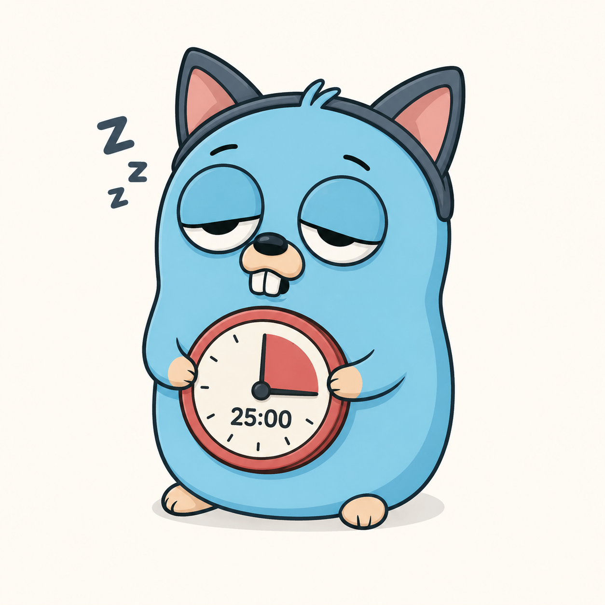

# bub



A tiny Pomodoro timer for the terminal — built with [Bubble Tea][bt],
[Bubbles][bubbles] (the `progress` component), and [Lip Gloss][lg].

```
🍅  Focus #3
  3 of 4 before a long break
  ████████████████░░░░░░░░░░░░░░░░░░░░░░░░  41%
  14:42  /  25:00   ·   2 pomodoros done
  space pause · s skip · r restart · q quit
```

In automatic mode the title shows the running session number (`Focus #3`,
`Break #2`, …) and the line under it shows where you are in the cycle. Manual
runs (`bub work 25`) are a single block, so they just show `🍅  Focus`.

## Install

```sh
go install github.com/michael-duren/bub@latest
```

…or from a clone:

```sh
go mod tidy
go build -o bub .
```

## Usage

### Manual mode — one block, your length

```sh
bub work 25      # a 25-minute work block
bub break 5      # a 5-minute break  ("rest" works too)
bub work         # default 25 minutes
bub 50           # shorthand for "bub work 50"
```

### Automatic mode — full Pomodoro loop

```sh
bub              # work → short break → … → long break → repeat, forever
bub auto         # same thing
```

Defaults: 25 min work, 5 min short break, 15 min long break, with the long
break taking the place of every 4th short break.

### Keys

| key            | action               |
| -------------- | -------------------- |
| `space` / `p`  | pause / resume       |
| `s`            | skip to the next step|
| `r`            | restart current step |
| `q` / `ctrl+c` | quit                 |

## Notifications (macOS)

When running on macOS, bub sends a native push notification each time a step
finishes. The notification title names the completed step (e.g. `🍅  Focus #1
done`) and the body shows the elapsed time plus what's coming next (e.g.
`25:00 elapsed · up next: Break`).

If [`terminal-notifier`](https://github.com/julienXX/terminal-notifier) is
installed, bub uses it to show the custom bub icon in the banner:

```sh
brew install terminal-notifier
```

Without `terminal-notifier`, bub falls back to `osascript` (no custom icon).
On other platforms the feature is a no-op.

## Config

Automatic mode reads `~/.config/.bub.yaml` if it exists. All fields are
optional — see [`.bub.yaml.example`](.bub.yaml.example):

```yaml
work_minutes: 25
short_break_minutes: 5
long_break_minutes: 15
long_break_every: 4
```

[bt]: https://github.com/charmbracelet/bubbletea
[bubbles]: https://github.com/charmbracelet/bubbles
[lg]: https://github.com/charmbracelet/lipgloss
